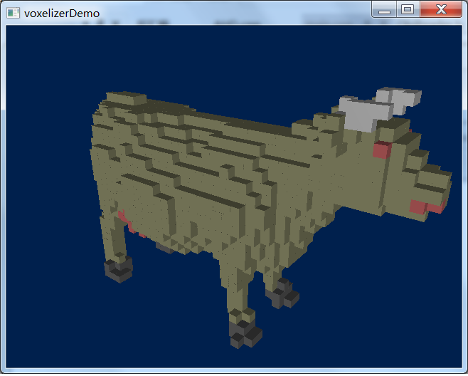
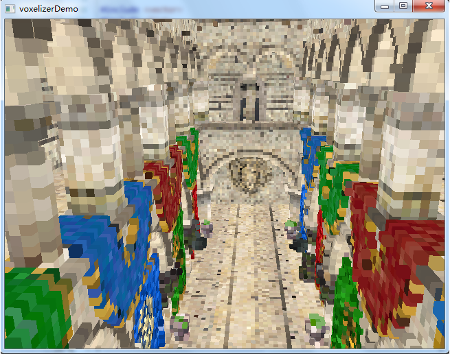

# AfterHumanDeclined 
A very fast GPU-based voxelizer, request d3d11 and shader model 5.0

  
  

--

### how to use
  
- simple sample
```C++
#include "AHD.h"

AHD::Voxelizer voxelizer;
 
//resource is using to create or store vertexbuffer and indexbuffer
VoxelResource* resource = voxelizer.create();

//original data or ID3D11Buffer are both ok
resource->setVertex(vertexData, vertexDataSize, vertexStride);
resource->setIndex(indexData, indexDataSize, indexStride);

//effect is using to setup render state, every resource needs one effect
DefaultEffect effect;
voxelizer.addEffect(&effect);
resource->setEffect(&effect);

//create output object, it supports multi uav at same time
VoxelOuput* output = voxelizer.createOutput();
size_t slot = 1;
size_t elementSize = 4;
output.addUAV(slot, DXGI_FORMAT_R8G8B8A8_UNORM, elementSize);

//calculate and get result
voxelizer.voxelize(output, 0, &resource);

//release the hardware resource in effect
voxelizer.remove(&effect);

//get data
VoxelData data;
output.exportData(data, slot);

```